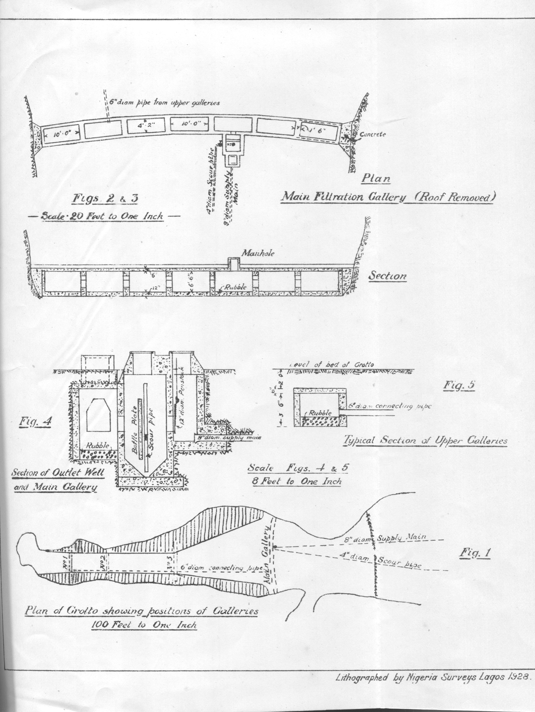

## Figures 1 to 5: Plan of Grotto and layout of Galleries
← Previous: [Page 14](imgew14.md); Next: → [Figures 6-8](imgewfig0608.md); Back to: [Index](../combined.md)

  

<em>Figures 2-3 Filtration Gallery</em>

<em>Figures 4 & 5  Gallery Sections</em>

<em>Figures 1 Plan of  Grotto and  Galleries 100 Feet to one inch</em>

